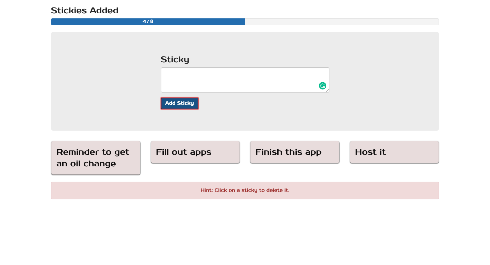

# Vue.js Stickies

> My Vue.js project

<<<<<<< HEAD

=======

>>>>>>> 1f9f8618dfdf7a78e9f0cbdba5bc5d3e9d3f9f61

## Build Setup

```bash
# install dependencies
npm install

# serve with hot reload at localhost:8080
npm run dev

# build for production with minification
npm run build
```

For detailed explanation on how things work, consult the [docs for vue-loader](http://vuejs.github.io/vue-loader).
